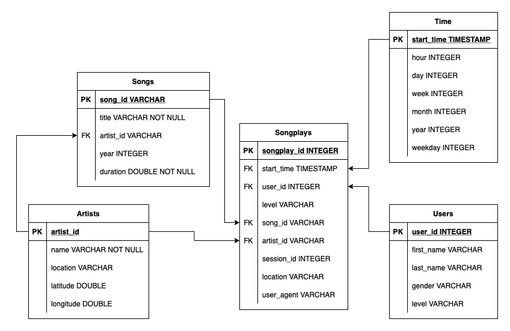
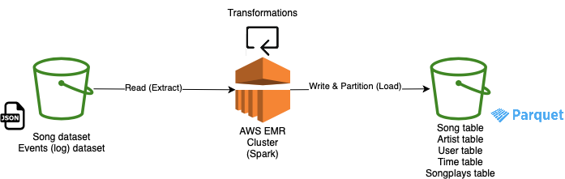

# Sparkify Data Lake

## Sparkify
Sparkify is a learning project which aims at analyzing collected data from songs and user activity on a music streaming app. Analysts want to understand what songs users are listening to. Currently, they don't have an easy way to query their data, which resides in a directory of JSON logs on user activity on the app, as well as a directory with JSON metadata on the songs in their app.

## Datasets

### Songs Dataset

The first dataset is a subset of real data from the [Million Song Dataset](http://millionsongdataset.com). Each file is in JSON format and contains metadata about a song and the artist of that song. The files are partitioned by the first three letters of each song's track ID.

### Logs Dataset

The second dataset consists of log files in JSON format generated by this event simulator based on the songs in the dataset above. These simulate activity logs from a music streaming app based on specified configurations. The log files in the dataset are partitioned by year and month.

## Schema

The following schema is following the [star schema](https://en.wikipedia.org/wiki/Star_schema) concept for DWHs. It is efficient for storing data and quering it in a relational DB.   

## ETL Pipeline

An ETL process is implemented in the script [etl.py](etl.py). The pipeline starts by reading data from an input bucket, stage them, transform them into the specified schema, partition them by the partition keys, and finally write them to an output S3 bucket in a compressed parquet files.

## How to run the scripts

First of all, you need to fill-in the [cfg file](dl.cfg) with AWS credentials (ACCESS_KEY, SECRET_ACCESS_KEY).

### Local mode

install pyspark by running `pip install pyspark` in your terminal, it will fetch you the latest released pyspark pip package.

run the script as is, or in a jupyter notebook.

### Cluster mode

Set up an EMR cluster on AWS with 3 instances (1 master, 2 workers). You need to setup the required packages for Spark, Hadoop, etc. A quick start of Spark should be sufficient.

Using your ssh key, you can transfer both the ETL python file along with the cfg file to the cluster. Afterwards, you can submit the script to the cluster using the spark-submit syntax: `/usr/bin/spark-submit --master yarn ./etl.py`.

Alternatively, you can also use the Notebooks feature of EMR to run the tasks on the spinned up cluster.
